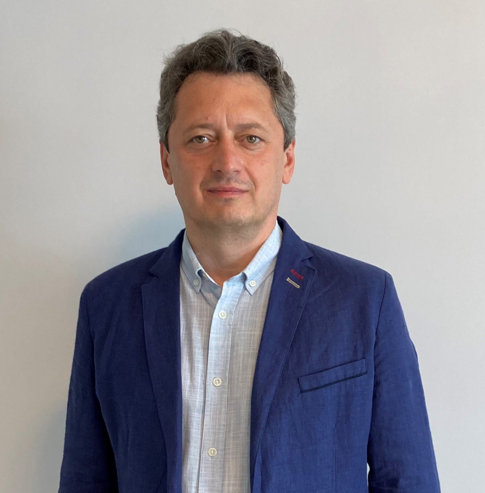

# Краткая информация о себе

**`Мужчина`**  
**`Проживает:`** Москва, м. Коломенская  
**`Гражданство:`** Россия, есть разрешение на работу: Россия.  
Не готов к переезду, готов к командировкам

### **`Образование`**
***Высшее***  
1993 - Санкт-Петербургский государственный политехнический университет, Санкт-Петербург  
_Радиофизика, Радиофизика и электроника, инженер-радиофизик-исследователь_

### **`Повышение квалификации, курсы`**

2017 - Промышленное и гражданское строительство, Строительство  
_ФГБОУ ВО НИУ «МЭИ» , профессиональная переподготовка_

2014 - Программа МВА "Управление инновационными проектами"  
_Московская международная высшая школа бизнеса МИРБИС, Москва_

2012 - Управление рисками и критическими ситуациями в проектах  
_LiCO, Сертификат № 21130_

2008 - Навыки проведения эффективных презентаций  
_ООО «Пентаграмм Групп», Сертификат № 0230015_

2006 - Project Management Fundamentals  
_IBM, Сертификат №ECM-02268/06_

2006 - Microsoft Solutions Framework Essentials  
_Project Botticelli Ltd, Сертификат № MOC #1846_

### **`Дополнительная информация`**

_Обо мне_	- Имею сильные навыки в области управления ресурсами проектов, планирования сроков реализации, контроля исполнения бюджета.
- С 2018 года состою в Национальном реестре специалистов в области строительства, ИН С-77-019885 (строительство, реконструкция, капитальный ремонт объектов капитального строительства).
- С 2020 года состою в Национальном реестре специалистов в области инженерных изысканий и архитектурно-строительного проектирования, ПИ-124555. 
